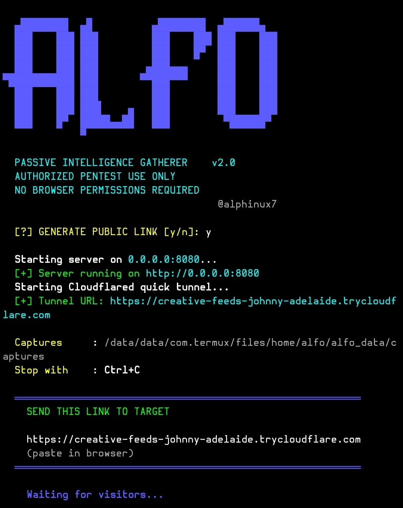

# Alfo


A lightweight **Device Information Gathering Tool** for **Termux** and **Kali Linux** that can collect device information **through a generated link** for **authorised security testing and educational purposes only**.

## ⚙️ Installation

### 1. Clone the repository

```bash
git clone https://github.com/alphinux/Alfo.git
```
### 2. Install Cloudflared 

```bash
apt install cloudflared -y
```

### 3. Enter the project folder

```bash
cd Alfo
```

### 3. Make the script executable

```bash
chmod +x alfo.py
```

### 4. Run the tool

```bash
python alfo.py
```

## 📱 Requirements

- Python
- Termux (No Root Required) or Kali Linux
- Internet connection
- cloudflared 

## ⚠️ Warning

**This tool is intended only for authorised security testing and educational demonstrations.**

- ✅ Use only on devices and accounts **you own** or for which you have **explicit permission** from the owner.
- ❌ Do **not** use this tool to collect information from other people's devices without their informed consent.
- The author is **not responsible** for any misuse, illegal activity, or damage resulting from the use of this software.
- You are solely responsible for complying with all applicable laws and regulations in your country.

## 📜 License

Use responsibly, ethically, and only with proper authorisation.
